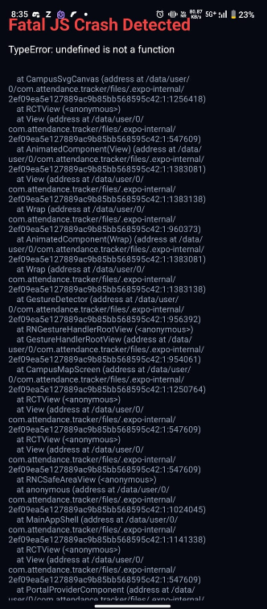
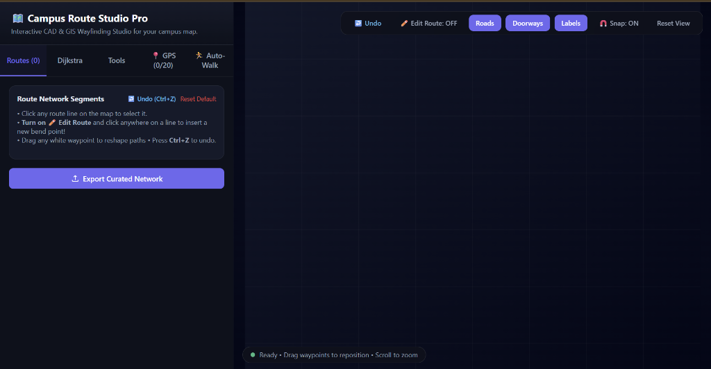

# 🎓 Attendance Tracker & Campus GIS Wayfinding System

[](https://www.typescriptlang.org/)
[](https://reactnative.dev/)
[](https://expo.dev/)
[](https://expo.dev/)
[](https://supabase.com/)
[](https://opensource.org/licenses/MIT)

> **A sub-meter campus GIS navigation and academic tracking engine featuring affine coordinate georeferencing, Dijkstra graph pathfinding, and real-time map-matching sensor fusion.**

---

## 📌 Architectural Overview

Traditional commercial map services (Google Maps, OpenStreetMap) fail in university campuses: architectural blueprints are private, outdoor satellite imagery lacks granular internal corridors/walkways, and mobile GPS suffers 15–90m multipath reflections near reinforced concrete blocks.

This system bridges that gap with a **closed-loop geospatial architecture**:
1. **Desktop CAD GIS Studio (`tools/CampusRouteStudio.html`)**: An interactive in-browser vector drafting suite for tracing 2D building geometries, arterial road polylines, doorstep connectors, and field-calibrating ground-truth GPS coordinates.
2. **Mobile Wayfinding Engine (`app/`)**: A production-grade React Native application running real-time Kalman/EMA smoothing, affine georeferencing, orthogonal road-snapping, and an adaptive residual bias learning loop.

```
Raw Phone GPS Telemetry (Lat, Lng, Accuracy, Speed, Heading)
                            │
                            ▼
              ┌───────────────────────────┐
              │  Outlier & Spike Filter   │  <-- Rejects accuracy > 40m & velocity jumps
              └─────────────┬─────────────┘
                            │
                            ▼
              ┌───────────────────────────┐
              │ Affine Transform (3x3 M)  │  <-- Projects WGS84 (Lat, Lng) -> SVG Canvas (X, Y)
              └─────────────┬─────────────┘
                            │
                            ▼
              ┌───────────────────────────┐
              │   EMA Smoothing Filter    │  <-- Low-pass filter (prevents avatar vibration)
              └─────────────┬─────────────┘
                            │
                            ▼
              ┌───────────────────────────┐
              │ Map-Matching Road Snapper │  <-- Orthogonal vector projection to walkways
              └─────────────┬─────────────┘
                            │
              ┌─────────────┴─────────────┐
              ▼                           ▼
┌───────────────────────────┐   ┌───────────────────────────┐
│ Reanimated 60 FPS View    │   │ Adaptive Bias Learner     │
│ - Isometric 3D Extrusions │   │ - Corrects shadow drift   │
│ - Dijkstra Pathfinding    │   │ - Saves to AsyncStorage   │
└───────────────────────────┘   └───────────────────────────┘
```

---

## 📸 Visual Showcase

| Live Campus Navigation | CAD Route Studio |
|:---:|:---:|
|  |  |
| *Real-time position tracking with orientation cone & Dijkstra path* | *Sub-pixel vector drafting & affine matrix calibration* |

---

## ⚡ Core Engineering Highlights

### 1. High-Precision Affine Transformation Matrix
Translates non-linear WGS84 geographic coordinates $(\text{lng}, \text{lat})$ into local SVG architectural coordinates $(x, y)$ using a calibrated transformation matrix:

$$\begin{bmatrix} x \\ y \\ 1 \end{bmatrix} = \begin{bmatrix} a & b & c \\ d & e & f \\ 0 & 0 & 1 \end{bmatrix} \begin{bmatrix} \text{lng} \\ \text{lat} \\ 1 \end{bmatrix}$$

- Calibrated using 17 ground-truth field anchors across the campus.
- Accounts for campus rotation, scale, skew, and local coordinate offsets.

### 2. Orthogonal Map-Matching (Road Snapping)
To prevent the user's position indicator from wandering through walls or floating over rooftops due to satellite noise, every coordinate is orthogonally projected onto the nearest active walkway edge:

$$\mathbf{p}_{\text{proj}} = \mathbf{n}_1 + t (\mathbf{n}_2 - \mathbf{n}_1), \quad t = \text{clamp}\left( \frac{(\mathbf{p} - \mathbf{n}_1) \cdot (\mathbf{n}_2 - \mathbf{n}_1)}{\|\mathbf{n}_2 - \mathbf{n}_1\|^2}, 0, 1 \right)$$

If the perpendicular distance $\|\mathbf{p} - \mathbf{p}_{\text{proj}}\| \le 38\text{px}$ ($\approx 19\text{m}$), the avatar snaps dead-center to the physical road.

### 3. Adaptive "Robot" Residual Bias Learning
Different areas of campus suffer from asymmetrical satellite shadowing (e.g. multi-story workshops blocking signals from the west). 
- Every time a student marks attendance or reaches an entrance door, the system compares ground-truth coordinates with telemetry.
- Computes residual bias $(\Delta x, \Delta y)$ and blends it into local calibration memory via recursive updating, making the map progressively more accurate with every use.

### 4. 100% Deterministic Dijkstra Routing
- **87 Waypoint Nodes & 95 Interconnected Edges** spanning 11 curated arterial roads and exact doorstep connectors.
- Automated tests verify **100% reachability (22/22 buildings)** with sub-2ms pathfinding latency.

---

## 🛠️ Project Structure

```
├── assets/                  # Icons, splash screens, blueprint overlays
├── docs/
│   └── screenshots/         # Production UI screenshots & architectural diagrams
├── src/
│   ├── components/
│   │   ├── AttendanceSimulatorSheet.tsx  # In-memory what-if bunk simulator
│   │   ├── StopwatchTimerBanner.tsx      # Lecture duration & countdown timer
│   │   └── map/
│   │       ├── CampusSvgCanvas.tsx       # 60 FPS animated SVG canvas with 3D extrusion
│   │       └── BuildingDetailSheet.tsx   # Glassmorphic floor directory & directions
│   ├── data/
│   │   ├── CampusBuildings.ts            # 23 buildings, polygons, & physical walkways
│   │   ├── MapGraph.ts                   # 87 graph nodes & 95 topological edges
│   │   └── IndoorDirectories.ts          # Multi-floor room directories & labs
│   ├── screens/
│   │   └── main/
│   │       ├── CampusMapScreen.tsx       # Real-time navigation & gesture viewport
│   │       ├── DashboardScreen.tsx       # Attendance cards & timetable overview
│   │       └── AnalyticsScreen.tsx       # Subject statistics & attendance forecasting
│   ├── services/
│   │   ├── LocationService.ts            # Affine matrix, road snapping, EMA smoother
│   │   ├── PathfindingService.ts         # Dijkstra shortest-path navigation
│   │   ├── DatabaseService.ts            # Supabase PostgreSQL data persistence
│   │   └── SyncService.ts                # Offline-first bidirectional synchronization
│   └── theme/                            # Color tokens, typography, and spacing
└── tools/
    └── CampusRouteStudio.html            # Standalone CAD GIS Wayfinding Studio
```

---

## 🚀 Getting Started

### Prerequisites
- Node.js 20+
- npm or yarn
- Expo Go / Android Studio / Xcode

### Installation
```bash
# Clone the repository
git clone https://github.com/jatinhemnani26/attendancetracker.git
cd attendancetracker

# Install dependencies
npm install

# Start local Metro bundler
npx expo start
```

### Running the CAD Studio
Open `tools/CampusRouteStudio.html` in any modern browser:
- Draft road waypoints and doorways directly on campus blueprints.
- Test Dijkstra pathfinding in real-time.
- Export curated network payloads directly into the mobile data layer.

### Over-The-Air (OTA) Updates
The project is configured with **EAS Update** for instant hot-reloads without rebuilding native binaries:
```bash
# Deploy to production channel
npx eas-cli update --branch production --environment production --message "Update description"

# Deploy to preview channel
npx eas-cli update --branch preview --environment preview --message "Update description"
```

---

## 📄 License
This project is open-source under the [MIT License](LICENSE).
