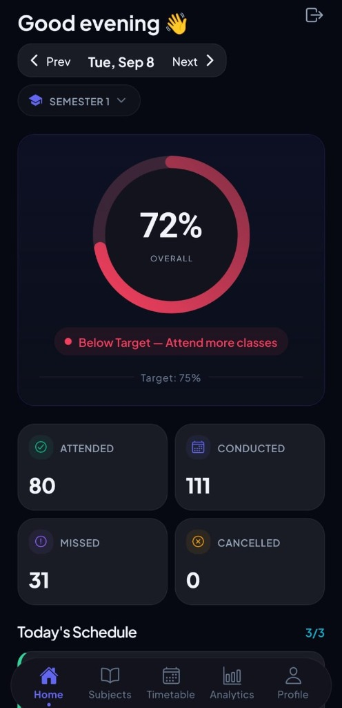
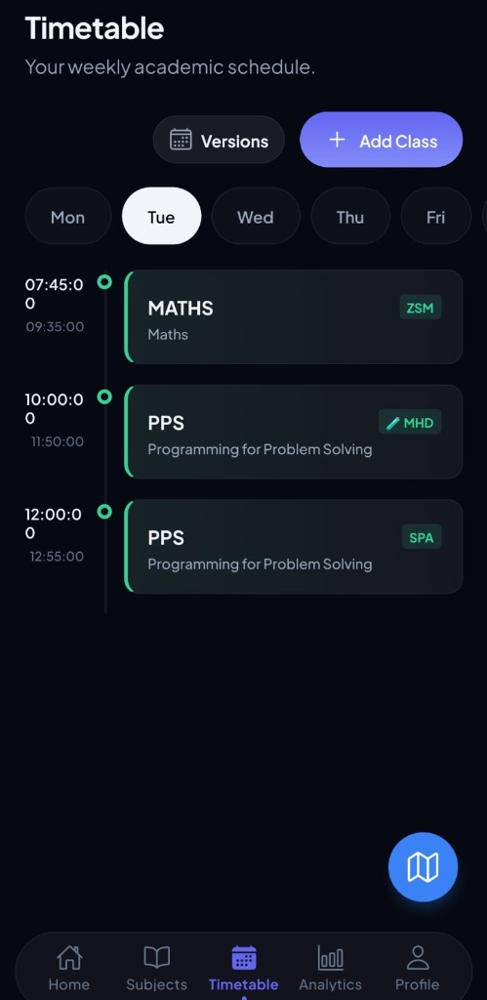
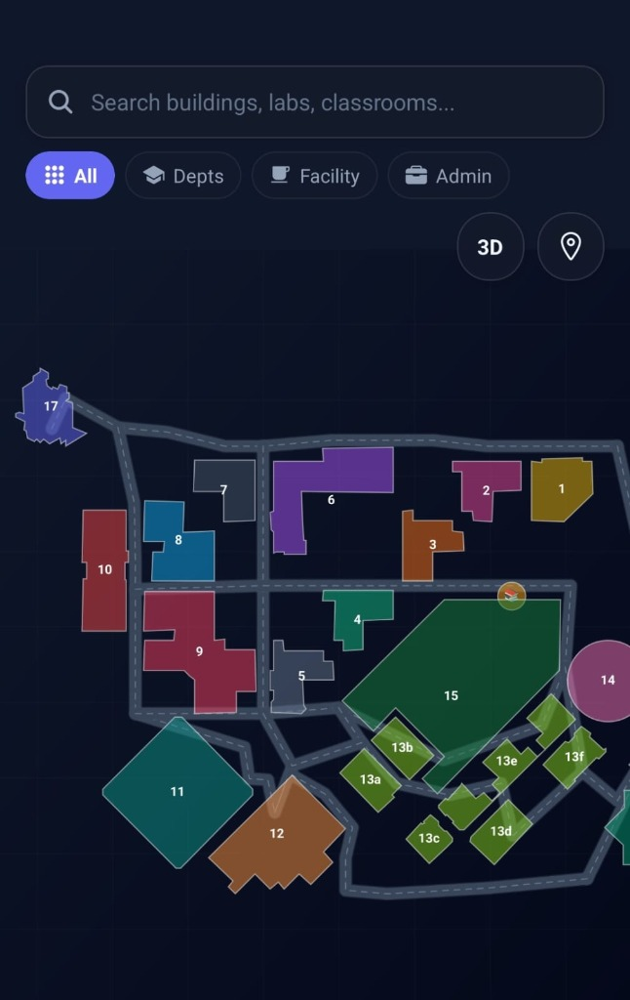
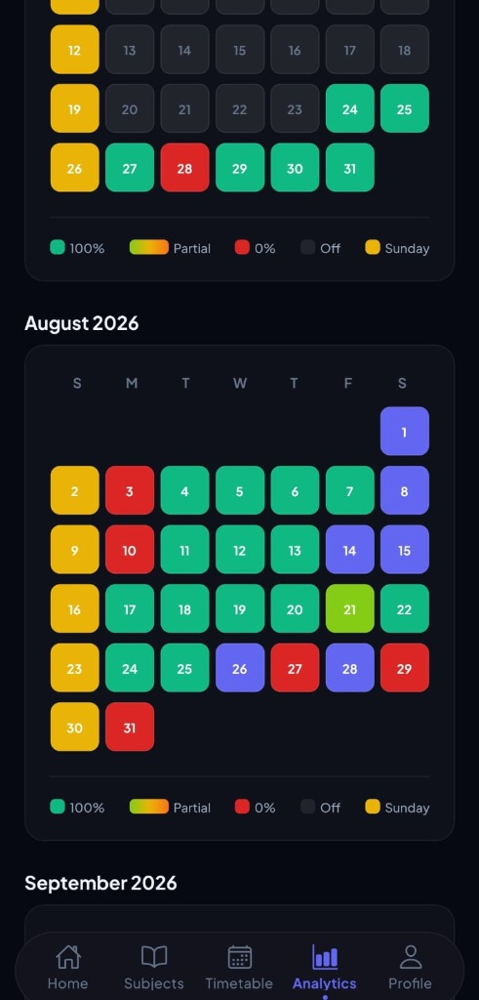

# 🎓 Attendance Tracker & Campus GIS System

[](https://www.typescriptlang.org/)
[](https://reactnative.dev/)
[](https://expo.dev/)
[](https://expo.dev/)
[](https://supabase.com/)
[](https://opensource.org/licenses/MIT)

An all-in-one **academic operating system and indoor/outdoor campus navigation engine** for university students. Combines real-time attendance compliance monitoring, bunk forecasting, timetable automation, and a custom architectural GIS wayfinding engine with road-snapped GPS tracking.

---

## 📱 Visual Showcase

| Home Dashboard & Metrics | Weekly Timetable & Alerts |
|:---:|:---:|
|  |  |
| *Master attendance gauge, institutional target thresholds, and live KPI summary* | *Daily class timeline, teacher initials, and floating navigation launcher* |

| Vector Campus Map & 3D Extrusion | Attendance Heatmap Calendar |
|:---:|:---:|
|  |  |
| *Custom architectural blueprint with physical walkways and deep room search* | *Color-coded monthly attendance grid tracking daily attendance patterns* |

---

## 🚀 Core Features

### 1. Attendance Engine & What-If Bunk Simulator
- **Master Compliance Gauge:** Real-time circular dial showing overall percentage against university mandatory thresholds (e.g., 75% minimum).
- **KPI Summary Cards:** Live counters for Attended, Conducted, Missed, and Cancelled lectures with semester-level filtering.
- **Predictive Bunk Simulator (`AttendanceSimulatorSheet.tsx`):** In-memory sandbox to forecast the exact mathematical impact of future class decisions before skipping:
  - **Safe Bunks:** Calculates exactly how many classes you can skip without falling below the 75% requirement.
  - **Recovery Count:** Calculates consecutive attendances required to recover from a low percentage.
- **Live Class Stopwatch Timer (`StopwatchTimerBanner.tsx`):** Real-time counter monitoring ongoing lecture duration with active status banners.

### 2. Analytics & Monthly Attendance Heatmap
- **Daily Status Heatmap (`AnalyticsScreen.tsx`):** GitHub-style monthly calendar view color-coded by daily attendance:
  - 🟢 **100% Attended** (Full green)
  - 🟡 **Partial Attendance** (Lime / Orange)
  - 🔴 **0% / Absent** (Red)
  - 🟣 **College Off / Holiday** (Dark purple)
  - 🟠 **Sundays / Weekends** (Yellow)
- **Subject-Wise Analytics:** Granular drill-down displaying individual subject percentages, professor details, and required classes.

### 3. Weekly Timetable & Smart Alerts
- **Interactive Day-by-Day Schedule (`TimetableScreen.tsx`):** Clean weekday timeline (Mon–Sat) showing subject codes, faculty tags, and exact classroom numbers.
- **Pre-Class Push Notifications (`NotificationService.ts`):** Automated local background alerts delivered 10 minutes before every lecture with subject name, room number, and teacher info.
- **Timetable Versions:** Support for alternating lab batches, exam schedules, and odd/even semester configurations.

### 4. Academic Tasks & Deadlines (`TaskService.ts`)
- Integrated task tracker for university assignments, project deadlines, quizzes, and exams.
- Categorized by urgency, subject relation, and completion state with Supabase sync.

### 5. Campus GIS Navigation & Turn-by-Turn Wayfinding
- **2D/3D Isometric Architectural Canvas (`CampusSvgCanvas.tsx`):** Custom dark-mode SVG rendering of 23 campus buildings with extruded 3D heights, walkways, and campus amenities.
- **Deep Room & Lab Directory (`IndoorDirectories.ts`):** Multi-floor room finder covering engineering labs, departmental libraries, seminar halls, and faculty cabins.
- **Dijkstra Shortest-Path Graph (`MapGraph.ts`):** 87 nodes and 95 interconnected edges providing 100% pathfinding reachability between every building on campus while strictly routing around building perimeters.
- **Walkway-Snapped GPS Engine (`LocationService.ts`):**
  - **Affine Transformation:** Converts standard GPS $(\text{Latitude}, \text{Longitude})$ coordinates to local blueprint $(X, Y)$ canvas coordinates via an empirical $3 \times 3$ transformation matrix.
  - **Outlier Gate:** Discards low-accuracy satellite fixes ($> 40\text{m}$) and impossible speed jumps.
  - **Adaptive EMA Smoothing:** Low-pass Exponential Moving Average filter ($x_{\text{smooth}} = \alpha x_{\text{new}} + (1-\alpha) x_{\text{prev}}$) ensuring the location avatar glides without jitter.
  - **Orthogonal Road Snapper:** Vector-projects location updates onto the nearest physical walkway centerline within 19 meters so the avatar never cuts through building walls.
  - **Empirical Bias Learning:** Stores localized building shadow adjustments in `AsyncStorage` whenever attendance is marked at a known doorway.

### 6. Interactive CAD GIS Studio (`tools/CampusRouteStudio.html`)
- A standalone in-browser vector CAD suite built for map architects:
  - Interactive polyline routing with insert, drag, and delete waypoint controls.
  - Ground-truth GPS calibration mapping.
  - Live Dijkstra graph inspector with connectivity diagnostics.

### 7. Security, Auth & Offline-First Persistence
- **Biometric App Lock (`SecurityService.ts`):** Fingerprint and Face ID authentication via `expo-local-authentication` to secure academic records.
- **Offline-First Storage:** Local persistence via `@react-native-async-storage/async-storage` with seamless background sync to Supabase PostgreSQL.

---

## 📐 Mathematical Grounding (GIS Engine)

### 1. Affine Coordinate Georeferencing
Transforms WGS84 geographic coordinates $(\text{lng}, \text{lat})$ into 2D SVG canvas pixels $(x, y)$:

$$\begin{bmatrix} x \\ y \\ 1 \end{bmatrix} = \begin{bmatrix} a & b & c \\ d & e & f \\ 0 & 0 & 1 \end{bmatrix} \begin{bmatrix} \text{lng} \\ \text{lat} \\ 1 \end{bmatrix}$$

- Fitted using 17 ground-truth field anchors captured directly across campus buildings.
- Handles campus blueprint rotation, scaling, and origin offsets without requiring third-party map tiling servers.

### 2. Orthogonal Road Snapping
Projects the smoothed user coordinate $\mathbf{p}$ onto the nearest walkway line segment between nodes $\mathbf{n}_1$ and $\mathbf{n}_2$:

$$t = \text{clamp}\left( \frac{(\mathbf{p} - \mathbf{n}_1) \cdot (\mathbf{n}_2 - \mathbf{n}_1)}{\|\mathbf{n}_2 - \mathbf{n}_1\|^2}, 0, 1 \right)$$

$$\mathbf{p}_{\text{snapped}} = \mathbf{n}_1 + t (\mathbf{n}_2 - \mathbf{n}_1)$$

If $\|\mathbf{p} - \mathbf{p}_{\text{snapped}}\| \le 38\text{px}$ ($\approx 19\text{m}$), the avatar snaps directly to the road centerline.

---

## 🗂️ Project Structure

```
├── assets/                          # App icons, splash screens, and blueprint assets
├── docs/
│   └── screenshots/                 # Production app screenshots
│       ├── dashboard.jpg            # Attendance dashboard & gauge
│       ├── timetable.jpg            # Weekly schedule & classes
│       ├── campus_map.jpg           # GIS map with road networks
│       └── analytics_heatmap.jpg    # Monthly attendance heatmap
├── src/
│   ├── components/
│   │   ├── AttendanceGauge.tsx      # Master circular compliance dial
│   │   ├── AttendanceSimulatorSheet.tsx # In-memory what-if bunk forecasting
│   │   ├── StopwatchTimerBanner.tsx # Live lecture duration tracker
│   │   ├── TaskSheet.tsx            # Academic deadline & assignment manager
│   │   └── map/
│   │       ├── CampusSvgCanvas.tsx  # 60 FPS animated vector canvas with 3D extrusions
│   │       └── BuildingDetailSheet.tsx # Multi-floor room directory & directions
│   ├── data/
│   │   ├── CampusBuildings.ts       # 23 buildings, polygons, and physical road paths
│   │   ├── MapGraph.ts              # 87 graph nodes & 95 topological edges
│   │   └── IndoorDirectories.ts     # Multi-floor room, lab, and cabin directory
│   ├── screens/
│   │   ├── auth/                    # Login, Register, Forgot Password, Biometric Lock
│   │   └── main/
│   │       ├── DashboardScreen.tsx  # KPI cards, today's schedule, and timetable
│   │       ├── AnalyticsScreen.tsx  # Monthly calendar heatmap & subject statistics
│   │       ├── TimetableScreen.tsx  # Weekly schedule manager
│   │       ├── SubjectsScreen.tsx   # Subject catalog & thresholds
│   │       └── CampusMapScreen.tsx  # Real-time navigation & gesture map
│   ├── services/
│   │   ├── LocationService.ts       # Affine matrix, road snapping, and EMA filter
│   │   ├── PathfindingService.ts    # Dijkstra shortest-path navigation
│   │   ├── NotificationService.ts   # Pre-class local push notifications
│   │   ├── DatabaseService.ts       # Supabase PostgreSQL data persistence
│   │   └── SyncService.ts           # Offline-first bidirectional sync
│   └── theme/                       # Design tokens (colors, typography, spacing)
└── tools/
    └── CampusRouteStudio.html       # Web-based CAD GIS Map Drafting Studio
```

---

## ⚡ Tech Stack

| Domain | Technology | Purpose |
|---|---|---|
| **Mobile Framework** | React Native 0.86, Expo SDK 57 | Cross-platform native runtime |
| **Language** | TypeScript 5.0+ | End-to-end type safety |
| **Vector Graphics** | React Native SVG, Reanimated 4 | 60 FPS animated blueprint & 3D extrusion |
| **Navigation & Math** | Custom Dijkstra Graph, Vector Projection | Sub-2ms pathfinding & road snapping |
| **Hardware & Sensors** | Expo Location, Expo Notifications, Expo Local Authentication | GPS telemetry, push alerts, biometrics |
| **Backend & Sync** | Supabase (PostgreSQL), AsyncStorage | Cloud data sync with offline-first caching |
| **Deployment** | Expo EAS Update | Instant Over-The-Air (OTA) production updates |

---

## 🚀 Getting Started

### Prerequisites
- Node.js 20+
- npm or yarn
- Expo Go app or Android/iOS simulator

### Setup & Run
```bash
# 1. Clone the repository
git clone https://github.com/jatinhemnani26/attendancetracker.git
cd attendancetracker

# 2. Install dependencies
npm install

# 3. Start local development server
npx expo start
```

### Running the Web CAD Studio
Open `tools/CampusRouteStudio.html` directly in any web browser to view, calibrate, or export campus road networks and waypoint graphs.

### 🌐 Deploying Web App to Vercel
This repository includes a pre-configured `vercel.json` and `"build": "expo export -p web"` script for automated Vercel deployment:
1. Import this repository into Vercel.
2. Under **Environment Variables**, supply:
   - `EXPO_PUBLIC_SUPABASE_URL`
   - `EXPO_PUBLIC_SUPABASE_ANON_KEY`
3. Click **Deploy**. Vercel will export the static web bundle into `dist` and serve the web version with direct in-app mobile APK download banners.

---

## 📄 License
This project is licensed under the [MIT License](LICENSE).
